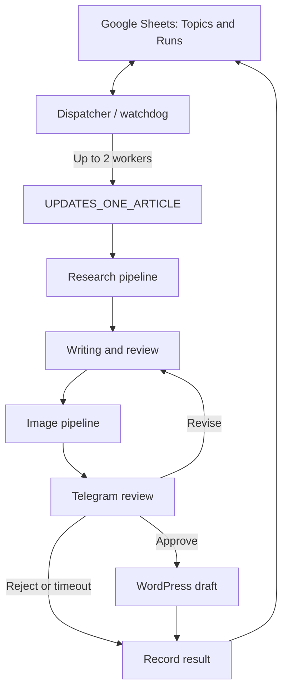

# N8N_LASSSSSSSST_WORKFLOWWWWWWWWWWWWWW

MCP export of the modular n8n pipeline for researching, writing, reviewing, illustrating, and creating legal-article drafts in WordPress.

**Snapshot: 8 October 2026.** All seven source workflows reported `active: false` and no active version at export time. The configured daily start is **04:50 AM, Africa/Cairo**. This repository captures configuration; it does not activate n8n or prove that a scheduled run is currently running.

## Workflow inventory

| Workflow export | Source workflow ID | Nodes | Responsibility |
| --- | --- | ---: | --- |
| [UPDATES_DISPATCHER_WATCHDOG](n8n/UPDATES_DISPATCHER_WATCHDOG.json) | `0CPzkx20lBJjxDnP` | 16 | Daily batches, reservations, concurrency limits, reconciliation, and batch notifications |
| [UPDATES_ONE_ARTICLE](n8n/UPDATES_ONE_ARTICLE.json) | `IMjOAASJew6ueG10` | 85 | One-article orchestration, settings, prompts, ownership, revisions, failure handling, and final sheet writes |
| [LAsST_RESEARCH_PIPELINE_V1](n8n/LAsST_RESEARCH_PIPELINE_V1.json) | `RrchbTCuPexd3TnG` | 9 | Legal, competitor, and existing-site research |
| [LAsST_WRITING_REVIEW_V1](n8n/LAsST_WRITING_REVIEW_V1.json) | `Nl6ERqJELg5KjSgD` | 14 | Source extraction, article writing, revisions, and content/SEO review |
| [LAsST_IMAGE_PIPELINE_V1](n8n/LAsST_IMAGE_PIPELINE_V1.json) | `I9bW653F3A14THuT` | 24 | OpenAI image generation, throttling, recovery, branding, and article packaging |
| [LAsST_TELEGRAM_REVIEW_V1](n8n/LAsST_TELEGRAM_REVIEW_V1.json) | `LvPZSaHkuamQyLw2` | 10 | Article/image delivery and human approval, revision, rejection, or timeout |
| [LAsST_WORDPRESS_DRAFT_V1](n8n/LAsST_WORDPRESS_DRAFT_V1.json) | `G7WOU8sUANPK8RXg` | 22 | Duplicate checks, media uploads, WordPress draft creation, and Rank Math metadata |

Total: **7 workflows / 180 nodes**. Node counts include triggers, helper/model nodes, and sticky notes.

The diagram shows the logical sequence. The main worker invokes each child and receives its output; child workflows do not directly invoke one another.

## Configured behavior

- Daily batch start: **04:50 AM in Africa/Cairo**, plus a watchdog every five minutes.
- The watchdog's dispatch gate permits new jobs from 04:50 onward; a missed daily trigger can therefore be followed by a later watchdog dispatch.
- Target: **10 confirmed WordPress drafts**, with at most **2 busy articles** and **15 candidate topics** per batch. Review waits count toward the busy limit.
- Topic selection follows sheet row order. Eligible rows have blank/`pending` status, a topic, and no batch, WordPress post ID, or WordPress URL.
- An unfinished batch prevents a new overlapping batch. The target is not a guarantee: rejections, timeouts, exhausted candidates, or blocked failures can reduce the completed count.
- Articles go through automatic review and Telegram approval before draft creation.
- Four images are expected: `featured`, `inline_1`, `inline_2`, and `inline_3`. The image module produces branded 1200 × 630 WebP assets.
- The WordPress output is a **draft**. An existing-post update mode discussed separately has **not** been implemented in this snapshot.

## Data and credentials

The configured spreadsheet is [Topics and Runs](https://docs.google.com/spreadsheets/d/1F1ePNxEyhGGAaXcid_qLuOn8-GRMhC16MKFWXWc0rx0). Its exact ordered headers and tab IDs are recorded in [SHEET_SCHEMA.json](docs/SHEET_SCHEMA.json).

Required credentials:

| Credential type | Used for |
| --- | --- |
| Google Sheets OAuth2 | Queue/ledger reads, writes, and coordination named ranges |
| OpenAI API | Research/writing models and image generation |
| Groq API | Image planning in the main worker |
| HTTP Header Auth: Tavily | Web search and source extraction |
| Telegram API | Human review and notifications |
| HTTP Basic Auth: WordPress | WordPress REST operations |
| HTTP Header Auth: WordPress custom API | Site-specific WordPress routes |

The JSON retains credential **IDs and names**, workflow references, spreadsheet identifiers, site addresses, and the configured Telegram chat ID. Credential secret values are not included. Execution history, pinned execution payloads, article binaries, live sheet rows, and secrets are not part of this export.

Configured model names are preserved from the source, including `gpt-5-mini` and `gpt-image-2.5-flare`. They are configuration values, not a guarantee of model availability for a different account or environment.

## Import and restore

1. Import the five child workflows, then the main worker, then the dispatcher. Keep them inactive while configuring.
2. Reconnect every credential. Importing JSON does not provision credential secrets.
3. Record the newly assigned workflow IDs. In the main worker, remap all five `Execute ...` nodes. In the dispatcher, remap `Start Article Worker`.
4. Update caller policies: the main worker permits the dispatcher; each child permits the main worker. Exported `settings.callerIds` contain source-instance IDs.
5. Review embedded workflow IDs in Code nodes as well as node parameters. The dispatcher's `Plan Dispatch` configuration includes `worker_id`.
6. Configure the spreadsheet, exact tab headers, numeric tab IDs, site endpoints, Telegram destination, logo, and model access. Some values are embedded in HTTP URLs and Code nodes; changing `Run Settings` alone is insufficient when migrating.
7. Restore or reconcile the Google Sheet ledger and coordination named ranges if restoring an existing installation. Workflow JSON alone cannot restore in-flight approvals, executions, locks, or published posts.
8. Check the custom WordPress and Rank Math endpoints required by the draft module. These are site-specific dependencies.
9. Validate a controlled article on the destination before production activation. This export/upload did not run the workflows.
10. Publish/activate children and the worker as required by the destination n8n instance, then the dispatcher last. Confirm the timezone and schedule before enabling it.

Avoid having two dispatchers connected to the same production queue during migration. The protected legacy workflow `eIio1X70hld4bHXy` is outside this export and was not changed.

## Maintenance and provenance

- [Maintenance guide](docs/MAINTENANCE.md): where to change behavior, how modules exchange state, and where to inspect failures.
- [Manifest](MANIFEST.json): source IDs, versions, activation state, file checksums, and snapshot scope.
- [Sheet schema](docs/SHEET_SCHEMA.json): exact header order used by the dispatcher.

The workflow graphs were read through n8n MCP and exported without changing their nodes, connections, groups, or settings. Non-import metadata and execution state were excluded. Local JSON, dependency, schema, secret-pattern, and checksum checks cover the export files only; no live workflow executions were started for this upload.
